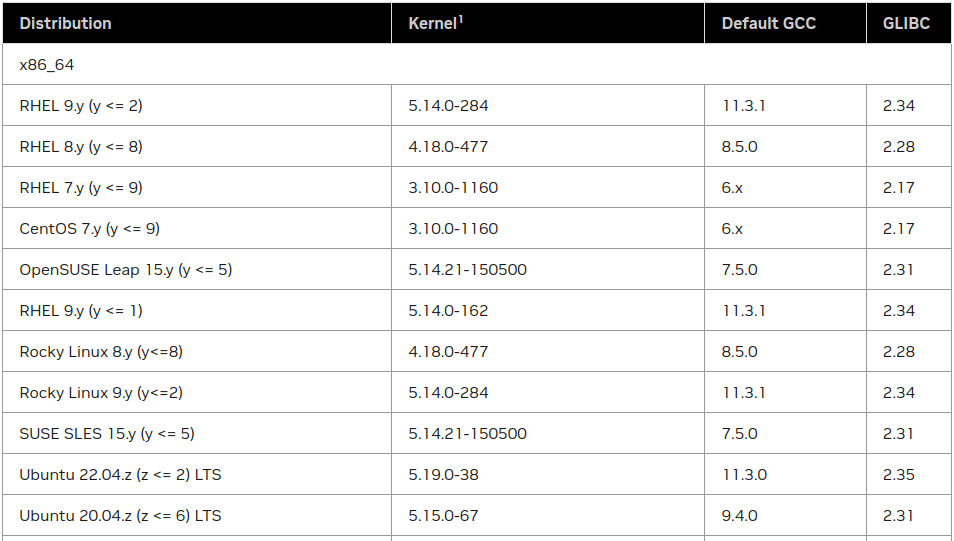

# NVIDIA CUDA Installition Guide for Linux

**该教程是针对 CUDA 12.2 版本的安装，若需要其他版本CUDA，请参考链接CUDA ToolKit Archive。**

## 1. 安装前确认项
在Linux上安装CUDA ToolKit之前，必须执行以下操作：

- 验证系统是否具有支持CUDA的GPU

- 验证系统运行的是受支持的Linux版本

- 验证系统是否已安装gcc

### 1.1 验证是有拥有支持CUDA的GPU
要验证 GPU 是否支持 CUDA，可从命令行输入:

```bash
lspci | grep nvidia
```

### 1.2 验证是否是支持CUDA的Linux版本
CUDA ToolKit仅在某些特定的Linux发行版上受支持。关于CUDA 12.2版本与受支持的Linux版本对应关系，请查看下图。

要查看发行版信息，可从命令行输入:

```bash
uname -m && cat /etc/*release
```

### 1.3 验证 gcc 是否安装
gcc编译器是使用CUDA工具包进行开发所必需的。运行CUDA应用程序不需要它。它通常作为Linux安装的一部分进行安装，在大多数情况下，与支持的Linux版本一起安装的gcc版本将正常工作。

```bash
gcc --version
```

## 2. CUDA ToolKit 安装
请在 CUDA Toolkit 12.2 Downloads 链接中，依次选定 Operating System, Architecture, Distribution, Version,Installer Type，获取详细安装步骤。
示例如下：

> 笔记本型号: Precision 3561 (NVIDIA T600 Laptop GPU)
> Operating System: Linux
> Architecture: x86_64
> Distribution: Ubuntu
> Version: 20.04
> Installer Type: deb(local)

```bash
wget https://developer.download.nvidia.com/compute/cuda/repos/ubuntu2004/x86_64/cuda-ubuntu2004.pin
sudo mv cuda-ubuntu2004.pin /etc/apt/preferences.d/cuda-repository-pin-600
wget https://developer.download.nvidia.com/compute/cuda/12.2.1/local_installers/cuda-repo-ubuntu2004-12-2-local_12.2.1-535.86.10-1_amd64.deb
sudo dpkg -i cuda-repo-ubuntu2004-12-2-local_12.2.1-535.86.10-1_amd64.deb
sudo cp /var/cuda-repo-ubuntu2004-12-2-local/cuda-*-keyring.gpg /usr/share/keyrings/
sudo apt-get update
sudo apt-get -y install cuda
sudo reboot
```

## 3. 环境配置
CUDA 默认安装在 /usr/local 下，要想使用 CUDA工具包和驱动，需进行如下操作：

```bash
export PATH=/usr/local/cuda-12.2/bin:$PATH
export LD_LIBRARY_PATH=/usr/local/cuda-12.2/lib64:$LD_LIBRARY_PATH
```


若需要环境变量永久生效，可将以上两句加入 .bashrc 或 .zshrc。

## 4. Demo 验证
拉取 cuda-samples，编译验证。

## 5. 参考链接
[NVIDIA CUDA Installation Guide for Linux](https://docs.nvidia.com/cuda/cuda-installation-guide-linux/index.html)
