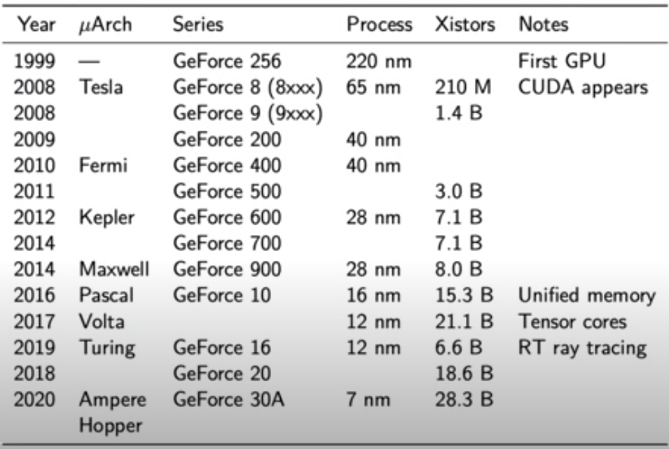
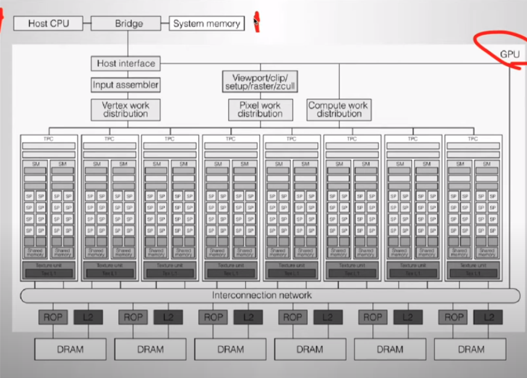
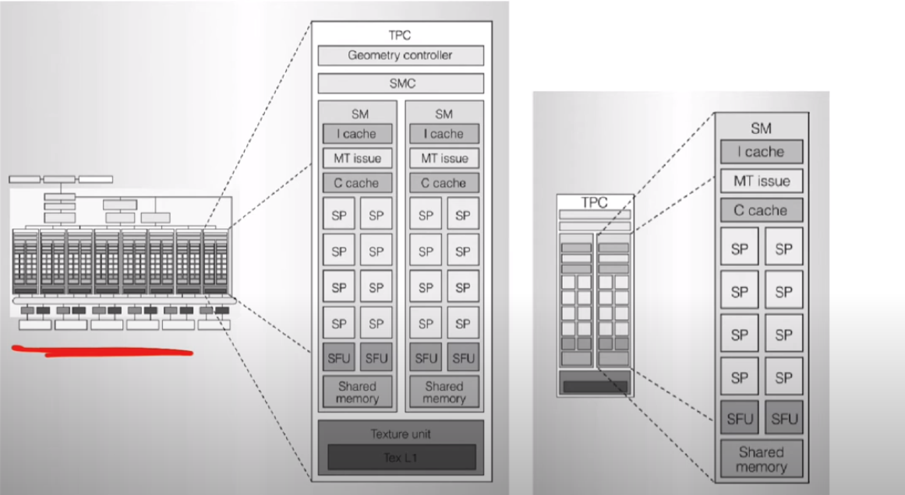

# CUDA Hardware

GPU 设计之初是用于图形处理，2008 年后具备通用计算能力。

## CPU vs GPU

两个指标
 - 延迟
 - 吞吐量

### 延迟
CPU 追求低延迟，对单个任务的响应时间非常敏感。GPU 的延迟较高，更关注吞吐量。

CPU 采用了复杂的流水线、大量缓存来减少延迟。GPU 流水线简单，但可以启动大量线程来隐藏延迟。

### 吞吐量

GPU 为了达到更高的吞吐量，可以同时运行极大量的线程，但是单个线程的延迟较高。

CPU 同时运行的线程较少，但每个线程拥有更低延迟。

### 设计取舍

CPU 追求每个线程的最低延迟。GPU 会牺牲延迟来换区更高的总体吞吐量。

CPU 可频繁中断现有任务来服务高优先级任务。GPU 一旦启动就要运行至完成。

### 适用场景

CPU 适用于对响应时间敏感的任务。

GPU 适用与数据密集的并行计算。

## Nvidia GPU

几个关键架构变更节点及内容如下：

1999 - GPU：仅用于图形计算与渲染

2008 - Tesla：CUDA 出现，具备通用计算能力

2016 - Pascal：统一内存地址，省去Host/Device间内存拷贝

2017 - Volta：引入针对深入神经网络设计的 Tensor core

2019 - Turing：添加光线追踪功能，本质上是用于图形渲染的实时光线追踪

## 概念

| 首字母缩略词 | 定义                                      |
| ------------ | ----------------------------------------- |
| **SM**       | Streaming Multiprocessor                  |
| **SP**       | Streaming Processor，通常所说的 CUDA core |
| TPC          | Texture/Processor Cluster                 |
| GPC          | Graphics Processing Cluster               |
| SP           | Single Precision (32-bit)                 |
| DP           | Double-precision (64-bit)                 |

2008 - Tesla 硬件架构图如下：

