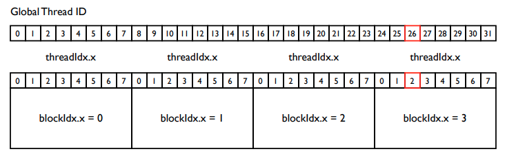

# CUDA Programming


## NVIDIA GPU 内存层次结构

- Grid 映射到 GPU
- Block 映射到 MP(MultiProcessors)
- Thread 映射到 SP(Streaming Processors)
- Warp 是同时执行的线程组(32个)


On the GPU

- Each thread has <font color='red'>local memory</font> (registers)
  - Private to the thread
- Each thread block has <font color='red'>shared memory</font>
  - Visible to all threads in thread block
- All threads can access <font color='red'>global memory</font>
  - Persistent across kernel launches in same app


## Function Declarations

| Keyword      | Execute On | Call On |
| ------------ | ---------- | ------- |
| `__device__` | Device     | Device  |
| `__global__` | Device     | Host    |
| `__host__`   | Host       | Host    |

## Host Run-Time Configuration

Host 编程会为核函数指定"grid - blocks -threads" 配置

- `<<< Dg, Db >>>`
- Dg 与 Db 的类型：
  - dim3
    - 内置三维类型
- Dg - 表征 grid 的尺寸
  - `Dg.x * Dg.y * Dg.z` blocks per grid
  - 可以是一维，二维，三维
- Db - 表征 block 的尺寸
  - `Db.x * Db.y * Db.z` threads per block
  - 可以是一维，二维，三维
  - 不允许超过 1024 个线程数

## Device Run-Time Configuration

- Host 在 Device 上启动核函数

- 核函数需要知道运行时配置

- 编译器提供内置类型

  | Type  | Variable  | Description            |
  | ----- | --------- | ---------------------- |
  | dim3  | gridDim   | grid 的尺寸            |
  | uint3 | blockIdx  | grid 中 block 的索引   |
  | dim3  | blockDim  | block 的尺寸           |
  | uint3 | threadIdx | block 中 thread 的索引 |

  以上变量均包含 x,y,z 三个元素。

### 确定线程的唯一 id

#### 1D Grids and 1D Blocks

```c
__device__ int getGlobalIdx_1D_1D() {
	return blockIdx.x * blockDim.x + threadIdx.x;
}
```



1D grids/blocks 适用于一维数据（数据集不超过 block 的硬件尺寸限制）。

#### 1D Grid and 2D Blocks

```c
__device__  int getGlobalIdx_1D_2D() { 
    return blockIdx.x * blockDim.x * blockDim.y  + threadIdx.y * blockDim.x + threadIdx.x; 
} 
```

#### 1D Grids and 3D Blocks

```c
__device__  int getGlobalIdx_1D_3D() { 
    return blockIdx.x * blockDim.x * blockDim.y * blockDim.z + threadIdx.z * blockDim.y * blockDim.x  + threadIdx.y * blockDim.x + threadIdx.x;  
}  
```

#### 2D Grids and 1D Blocks

```c
__device__ int getGlobalIdx_2D_1D() { 
    int blockId   = 
        blockIdx.x +
        blockIdx.y * gridDim.x;
    int blockOffset = 
        blockId * blockDim.x;
    int threadId = blockOffset + threadIdx.x; 
    return threadId;  
} 
```

#### 2D Grids and 2D Blocks

```c
__device__  int getGlobalIdx_2D_2D() { 
    int blockId = 
        blockIdx.x + 
        blockIdx.y * gridDim.x;
    int blockOffset = 
        blockId * 
        blockDim.x * blockDim.y;
    int threadOffset = 
        threadIdx.x + 
        threadIdx.y * blockDim.x;
    int threadId = blockOffset + threadOffset; 
    return threadId;  
} 
```

#### 2D Grids and 3D Blocks

```c
__device__  int getGlobalIdx_2D_3D() { 
    int blockId = 
        blockIdx.x  + 
        blockIdx.y * gridDim.x;
    int blockOffset = 
        blockId * 
        blockDim.x * blockDim.y * blockDim.z;
    int threadOffset = 
        threadIdx.x + 
        threadIdx.y * blockDim.x + 
        threadIdx.z * (blockDim.x * blockDim.y);
    int threadId = blockOffset + threadOffset;
    return threadId;  
}  
```

#### 3D Grids and 1D Blocks

```c
__device__  int getGlobalIdx_3D_1D() { 
    int blockId = 
        blockIdx.x + 
        blockIdx.y * gridDim.x + 
        (gridDim.x * gridDim.y) * blockIdx.z;
    int blockOffset = blockId * blockDim.x;
    int threadOffset = threadIdx.x;
    int threadId = blockOffset + threadOffset; 
    return threadId;  
} 
```

#### 3D Grids and 2D Blocks

```c
__device__  int getGlobalIdx_3D_2D() { 
    int blockId = 
        blockIdx.x + 
        blockIdx.y * gridDim.x + 
        (gridDim.x * gridDim.y) * blockIdx.z; 
    int blockOffset = 
        blockId *
        blockDim.x * blockDim.y;
    int threadOffset = 
        threadIdx.x +
        threadIdx.y * blockDim.x;
    int threadId = blockOffset + threadOffset; 
    return threadId;  
} 
```

#### 3D Grids and 3D Blocks

```c
__device__  int getGlobalIdx_3D_3D() { 
    int blockId = 
        blockIdx.x + 
        blockIdx.y * gridDim.x + 
        (gridDim.x * gridDim.y) * blockIdx.z; 
    int blockOffset = 
        blockId * 
        blockDim.x * blockDim.y * blockDim.z;
    int threadOffset = 
        threadIdx.x + 
        threadIdx.y * blockDim.x +
        threadIdx.z * (blockDim.x * blockDim.y);
    int threadId = blockOffset + threadOffset;
    return threadId;  
} 
```

## CUDA Run Time

- Device 内存管理
  - cudaMalloc
  - cudaFree
  - cudaMemcpy
- Shared memory (`__shared__` 限定符)

- 异步执行
  - Host 计算
  - Device 计算
  - 内存传输
- 同步执行

### SIMT 架构

- 单指令多线程
- 并行执行成百上千的线程
- 流水线
- 比CPU要简单
  - In-order instruction issue
  - No branch prediction
  - No speculative execution

### Wrap(线程束)

- 32个线程为一组

- 线程创建、管理、调度和执行的基本单位
- 每个指令周期，线程束的所有线程执行相同的指令

https://zhuanlan.zhihu.com/p/123170285

线程束是硬件层面的线程集合，真正的并行；

线程块是逻辑层面的线程集合，方便写程序。

#### 线程束的分化

严重影响并行性能。

