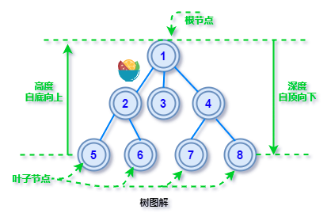

# 树与树的算法

树形数据结构特点:

- 没有父节点的节点成为根节点
- 每个节点都只有有限各子节点或无子节点
- 每个非根节点有且只有一个父节点
- 除了根节点，每个子节点可以分为多个不相交的子树
- 树里无环路

## 1. 二叉树

### 1.1 三种遍历方式

- 前序遍历：根节点->左子树->右子树
- 中序遍历：左子树->根节点->右子树
- 后序遍历：左子树->右子树->根节点

### 1.2 二叉查找树

对二叉树中的数据进行排序。排序规则为：左子树上的节点都小于根节点，右子树上所有节点的值都大于根节点

搜索的时间复杂度: 最大为O(n)

## 2. 平衡二叉查找树

AVL树有更严格的定义：在二叉查找树中，任一节点对应的两棵子树的最大高度差为 1，这样的二叉查找树称为平衡二叉树。

查找、插入和删除的时间负责度: 最大为O(log n)

## 3. B树

应用场景:数据读取及数据库索引

## 4. 红黑树

特征:

1. 节点是红色或黑色。
2. 根是黑色。
3. 所有叶子都是黑色（叶子是NIL节点）。
4. 每个红色节点必须有两个黑色的子节点。（从每个叶子到根的所有路径上不能有两个连续的红色节点。）
5. 从任一节点到其每个叶子的所有简单路径都包含相同数目的黑色节点。

关键特性：从根到叶子的最长的可能路径不多于最短的可能路径的两倍长

时间复杂度：

而节点的路径长度决定着对节点的查询效率，这样我们确保了，最坏情况下的查找、插入、删除操作的时间复杂度不超过O(log n)，并且有较高的插入和删除效率

应用场景:

- STL 标准库中的 multiset、multimap
- Linux 系统实现 EXT3 文件系统、虚拟内存管理系统

## 5. 参考链接

[1] [图解：数据结构中的6种[树]](https://jishuin.proginn.com/p/763bfbd2febb)

