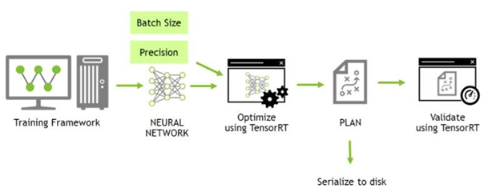
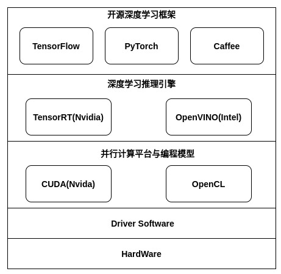
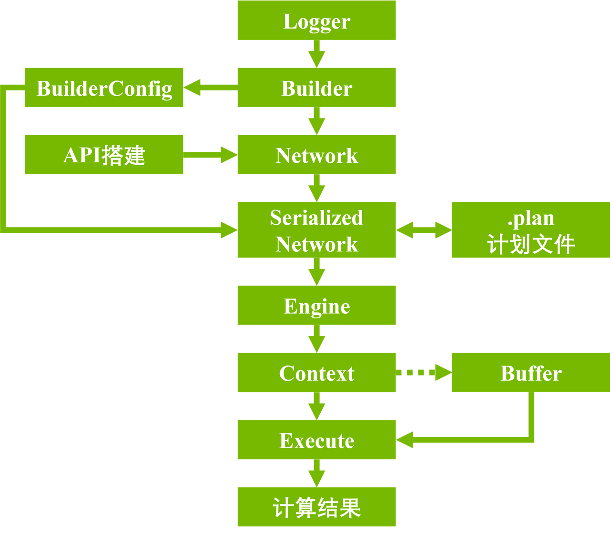

# NVIDIA Deep Learning TensorRT

## 1. 概述

基于 TensorRT 的深度学习开发周期如下图：



### 1.1 深度学习框架

#### 1.1.1 TensorFlow

TensorFlow是一个开源的机器学习框架，由Google开发和维护。它被广泛用于深度学习和机器学习任务，包括图像分类、自然语言处理、语音识别等领域。以下是TensorFlow的一些关键特点和概念：

1. 计算图（Computational Graph）：TensorFlow使用计算图来表示机器学习模型。计算图是一种抽象的数据结构，它描述了模型中各个操作的依赖关系。这使得TensorFlow可以高效地优化和执行计算，尤其适用于大规模深度学习模型。
2. 张量（Tensors）：在TensorFlow中，数据以张量的形式表示。张量是多维数组，可以是标量（0维张量）、向量（1维张量）、矩阵（2维张量）或更高维度的数组。张量是计算图中的节点，它们存储和传递数据。
3. 会话（Session）：TensorFlow中的计算是延迟执行的，需要在会话中运行计算图才能获得结果。会话提供了运行图的环境，并且可以在CPU或GPU上执行计算。
4. 变量（Variables）：变量是可以在计算图中持久保存值的节点。它们通常用于存储模型的参数，例如神经网络的权重和偏差。
5. 层和模型：TensorFlow提供了高级API，使构建深度学习模型更加方便。这包括Keras API，它提供了一种简单的方式来定义神经网络的层和模型结构。
6. 自动微分（Automatic Differentiation）：TensorFlow可以自动计算梯度，这对于训练神经网络非常重要。开发者可以使用梯度下降等优化算法来更新模型的参数。
7. GPU加速：TensorFlow支持在GPU上进行高性能计算，从而加速深度学习模型的训练和推理。
8. 广泛的生态系统：TensorFlow拥有庞大的社区支持和丰富的生态系统，包括各种扩展库、工具和预训练模型，使开发者能够更轻松地构建和部署机器学习应用程序。

TensorFlow的流行和广泛应用使其成为了深度学习领域的重要工具之一。它支持多种编程语言，包括Python、C++、Java等，使开发者可以根据自己的喜好和需求来使用。

#### 1.1.2 PyTorch

PyTorch是一个开源的深度学习框架，由Facebook的人工智能研究团队开发和维护。它提供了一个灵活的、动态的计算图模型，使得深度学习模型的定义和训练更加直观和容易。以下是PyTorch的一些关键特点和概念：

1. 动态计算图（Dynamic Computational Graph）：PyTorch使用动态计算图，与TensorFlow的静态计算图不同。这意味着你可以在运行时更自由地定义、修改和调试计算图，这对于研究和实验非常有用。
2. 张量（Tensors）：与TensorFlow类似，PyTorch也使用张量来表示数据。张量是多维数组，可以包括标量、向量、矩阵等不同维度的数据结构。
3. 自动微分（Automatic Differentiation）：PyTorch内置了自动微分机制，允许用户轻松计算梯度。这对于训练深度学习模型和实施梯度下降等优化算法非常有帮助。
4. 模块化设计：PyTorch的模块化设计使得构建和训练复杂的深度学习模型更加方便。你可以使用PyTorch的`nn.Module`来定义模型的各个组件，例如神经网络层、损失函数等。
5. GPU加速：PyTorch支持在GPU上进行高性能计算，这对于深度学习任务来说至关重要。你可以轻松地将张量移动到GPU上进行运算。
6. 丰富的生态系统：PyTorch拥有庞大的社区支持和丰富的生态系统，包括各种扩展库、工具和预训练模型，使开发者能够更轻松地构建和部署机器学习应用程序。
7. 部署支持：PyTorch提供了多种部署选项，包括将模型导出为ONNX格式、使用TorchScript进行模型序列化，以及PyTorch Mobile等，从而可以在不同的部署环境中使用PyTorch模型。

PyTorch的设计哲学注重用户友好和灵活性，这使得它成为研究、实验和原型开发的首选框架之一。与其他框架相比，PyTorch的动态计算图和Pythonic API使得深度学习任务更加直观和容易上手。它广泛应用于学术界和工业界，尤其在自然语言处理、计算机视觉和强化学习等领域中有很高的影响力。

#### 1.1.3 Caffe

Caffe（Convolutional Architecture for Fast Feature Embedding）是一个开源的深度学习框架，最初由伯克利视觉与学习中心（Berkeley Vision and Learning Center，BVLC）开发。Caffe早期主要用于计算机视觉任务，特别是卷积神经网络（CNN）的研究和应用。以下是关于Caffe的一些重要特点和概念：

1. 高性能和速度：Caffe被设计成高性能的深度学习框架，特别适用于大规模图像处理任务。它使用C++编写，采用了高度优化的计算核心，因此在训练和推断中表现出色，特别是在GPU上的运行。
2. 静态计算图：与PyTorch和TensorFlow不同，Caffe使用静态计算图，这意味着计算图在训练之前需要完全定义。这使得Caffe适用于一些需要高度优化的生产环境，但也可能使模型的定义相对不太灵活。
3. 层（Layers）：Caffe将神经网络模型表示为一系列层，每个层执行特定的操作，如卷积、池化、全连接等。用户可以自定义层或使用现有的层。
4. 模型定义文件：Caffe模型的结构和参数配置通过模型定义文件（通常是以.prototxt为扩展名的文本文件）进行描述。这个文件定义了网络层的结构、连接和超参数。
5. 二进制模型和权重文件：训练后的Caffe模型通常会保存为二进制模型文件（.caffemodel）和二进制权重文件（.binaryproto）。这些文件包含了模型的结构和参数。
6. 社区和生态系统：Caffe拥有广泛的用户社区和生态系统，包括许多预训练的模型和工具，可以用于各种计算机视觉任务。
7. 不再活跃的开发：尽管Caffe曾经是非常流行的深度学习框架之一，但它的开发活动已经相对减少，因此在一些方面可能不再与当前的深度学习趋势保持同步。许多研究和工业界的项目已经迁移到更现代的框架，如PyTorch、TensorFlow等。

总的来说，Caffe是一个针对计算机视觉任务和高性能需求的深度学习框架。虽然它不再是深度学习领域的主流框架，但在某些特定场景下仍然有其用武之地。如果你对计算机视觉任务感兴趣，可以考虑了解Caffe的使用和特性。

### 1.2 模型优化及推理框架

#### 1.2.1 TensorRT

TensorRT（Tensor Real-Time）是英伟达（NVIDIA）开发的一个用于高性能深度学习推理（Inference）的优化引擎。它旨在将深度学习模型（通常是训练好的模型）部署到英伟达GPU上，以提高推理速度和效率。以下是关于TensorRT的一些关键特点和概念：

1. 高性能：TensorRT专注于优化深度学习推理的性能，旨在加速模型的执行。它使用了各种技术，包括层融合、内存优化、精度混合和多精度推理等，以减少推理时间。
2. 支持各种框架：TensorRT支持多种深度学习框架，包括TensorFlow、PyTorch、Caffe等。这意味着你可以训练模型使用这些框架，然后使用TensorRT来进行高性能的推理。
3. 优化技术：TensorRT使用各种优化技术，如Kernel自动调优、层和运算符融合，以及GPU专用的优化，来提高模型的推理性能。
4. 支持多精度推理：TensorRT支持混合精度推理，这意味着它可以在保持模型精度的同时，使用更低精度的数值类型来加速计算。
5. 动态尺寸支持：TensorRT支持动态尺寸输入，允许模型处理不同大小的输入数据。
6. 支持多GPU：TensorRT支持在多个GPU上并行进行推理，进一步提高了性能。
7. 部署和嵌入：TensorRT可以轻松地集成到不同的部署环境中，包括云端服务器、嵌入式设备和边缘计算设备。它具有各种支持不同硬件架构的运行时库。
8. 易用性：TensorRT提供了Python和C++的API，使开发者可以轻松地将深度学习模型部署到英伟达GPU上。

TensorRT的主要目标是加速深度学习模型的推理过程，特别适用于对推理延迟和吞吐量要求较高的应用，如自动驾驶、计算机视觉、自然语言处理等。它允许开发者在保持模型精度的前提下，获得更高的推理性能。TensorRT通常与英伟达的深度学习框架（例如TensorFlow和PyTorch）以及英伟达GPU硬件一起使用，以实现最佳性能。

#### 1.2.2 OpenVINO

OpenVINO（Open Visual Inference and Neural Network Optimization）是英特尔（Intel）开发的一个用于深度学习推理和计算机视觉任务的工具套件。它的主要目标是优化和加速深度学习模型的推理，以便在不同硬件平台上实现高性能的实时计算机视觉和推理应用程序。以下是关于OpenVINO的一些关键特点和概念：

1. 跨硬件支持：OpenVINO被设计成跨多种硬件平台的工具套件，包括英特尔的CPU、集成GPU、FPGA（可编程逻辑门阵列）和神经计算棒（Neural Compute Stick）。这意味着你可以使用OpenVINO在不同的硬件上运行和优化深度学习模型。
2. 模型优化：OpenVINO提供了一套工具和技术，用于优化深度学习模型，以提高推理性能。这包括模型量化、层融合、模型压缩和剪枝等技术。
3. 模型部署：OpenVINO支持将优化后的深度学习模型轻松部署到不同的硬件平台上。它提供了多种部署选项，包括C++、Python API，以及支持多种操作系统的运行时库。
4. 模型转换：OpenVINO支持多种深度学习框架，如TensorFlow、Caffe、ONNX等。你可以使用OpenVINO的模型转换工具将模型从这些框架中转换为OpenVINO格式，以进行优化和部署。
5. 硬件加速：OpenVINO可以利用英特尔硬件的特性，如AVX-512指令集、集成GPU和FPGA，来提高深度学习推理的性能。
6. 模型库和预训练模型：OpenVINO附带了一些计算机视觉任务的预训练模型和模型库，使开发者能够更轻松地构建视觉应用程序。
7. 多通道推理：OpenVINO支持多通道（multi-streaming）推理，允许同时处理多个输入流或多个模型，这对于实时多摄像头应用程序非常有用。
8. 嵌入式和边缘计算支持：OpenVINO也可以在嵌入式设备和边缘计算环境中使用，以实现低延迟和实时性能的计算机视觉应用。

OpenVINO被广泛应用于各种计算机视觉和嵌入式深度学习应用，包括智能摄像头、自动驾驶、工业自动化、机器人技术等。它为开发者提供了一个跨硬件平台的解决方案，以优化和部署深度学习模型，从而在实时推理任务中获得卓越的性能。

### 1.3 并行计算框架

#### 1.3.1 CUDA

#### 1.3.2 OpenCL

以上几大框架的层次结构如下图：



## 2. 模型训练

暂不涉及

## 3. 模型推理



以 [MINST 手写数字识别模型](https://github.com/onnx/models/tree/main/vision/classification/mnist)为例:

### 3.1 模型信息

#### 3.1.1 输入

- 输入张量的形状为（1x1x28x28），类型为float32
- 一次一个图像，不支持批量

#### 3.1.2 预处理

- 图像大小调整为 28x28 的灰度图像
- 背景为黑色，前景为白色（数字应为白色）
- 颜色值缩放至 [0.0, 1.0]。

#### 3.1.3 输出

- 输出张量的形状为 （1x10），表示为各数字的可能性

#### 3.1.4 可视化

需下载模型可视化工具 netron，linux 下可通过 `snap install netron`下载，若需要在其他平台使用，请参考 netron [安装文档](https://github.com/lutzroeder/netron)。

执行 `netron xx.onnx` 即可查看模型具体的网络结构。

### 3.2 TensorRT 网络构建

有多种方式构建网络, 第一种是使用TensorRT安装包带的`trtexec`工具构建网络, 另一种是使用C++或者Python构建网络。

TensorRT 可通过优化网络计算图提高模型效率，相关的优化方法如下：

1. Weight & Activation Precision Calibration(Manual)

   通过将模型量化为 INT8 来最大化吞吐量，同时保持准确性

2. Layer & Tensor Fusion(Auto)

   通过融合内核中的节点来优化 GPU 内存和带宽的使用

3. Kernel Auto-tuning

   根据目标GPU平台选择最佳数据层和算法

4. Dynamic Tensor Memory

   最大限度地减少内存占用并有效地为张量重新使用内存

5. Multi-stream Execution

   可并行处理多个输入流的可扩展设计
   
6. Time Fusion
   
   使用动态生成的内核随时间步长优化循环神经网络

#### 3.2.1 trtexec

```Shell
sudo ln -s /usr/src/tensorrt/bin/trtexec /usr/bin/trtexec
trtexec --onnx=mnist.onnx --saveEngine=mnist.plan
```

> 参数

- `--onnx=./model.onnx`: 指定输入模型文件名
- `--saveEngine=./model.plan`: 指定输出序列化引擎文件名
- `--fp16、--int8、 --noTF32、--best`: 指定网络级精度
- `--maxBatch=<BS>`: 指定构建引擎的最大批量大小。仅当输入模型为 UFF 或 Caffe 格式时才需要。如果输入模型是 ONNX 格式，请使用`--minShapes`、`--optShapes`、`--maxShapes`标志来控制输入形状的范围，包括批量大小。
- `--memPoolSize=<pool_spec>`: 指定策略允许使用的工作空间的最大大小，以及 DLA 将分配的每个可加载的内存池的大小。

#### 3.2.2 C++

[TensorRT C++接口文档](https://docs.nvidia.com/deeplearning/tensorrt/api/c_api/)

1. logger

继承`nvinfer1::ILogger抽象类`, 重载`void log(Severity severity, nvinfer1::AsciiChar const* msg);`方法, 创建一个logger对象

```C++
class Logger : public nvinfer1::ILogger {
    void log(Severity severity, nvinfer1::AsciiChar const* msg) noexcept {
        if (severity != Severity::kINFO) {
          std::cout << "TensorRT: " << msg << std::endl;
        }
     }
 };
```

2. builder

```C++
Logger logger;
nvinfer1::IBuilder* builder = nvinfer1::createInferBuilder(logger);
```

3. config

```C++
nvinfer1::IBuilderConfig* config = builder->createBuilderConfig();
config->setMemoryPoolLimit(nvinfer1::MemoryPoolType::kWORKSPACE, 1 << 20); // 1MB
```

这个接口有很多属性，可以设置这些属性来控制 TensorRT 如何优化网络。一个重要的属性是最大工作空间大小。层实现通常需要一个临时工作空间，并且此参数限制了网络中任何层可以使用的最大大小。如果提供的工作空间不足，TensorRT 可能无法找到层的实现。默认情况下，工作区设置为给定设备的总全局内存大小；必要时限制它，例如，在单个设备上构建多个引擎时。

4. network

```C++
nvinfer1::INetworkDefinition* network = builder->createNetworkV2(
        1U << static_cast<uint32_t>(nvinfer1::NetworkDefinitionCreationFlag::kEXPLICIT_BATCH));
```

TensorRT支持两种指定网络的模式：显式批处理和隐式批处理。

- explicit batch

在显式批处理模式中，所有维度都是显式的，并且可以是动态的，也就是说，它们的长度可以在运行时更改。许多新功能（如动态形状和循环）仅在此模式下可用。ONNX解析器也需要它。

- implicit batch（已弃用）

在隐式批处理模式下，每个张量具有隐式批处理维度，其他维度必须是恒定尺寸。这种模式是由Tensorrt的早期版本使用的，现在已弃用，但继续支持向后兼容。

5. parser

将`onnx`模型转换为TensorRT网络, 解析不同的模型需要调用不同的接口, 对应的库在`/usr/lib/x86_64-linux-gnu`目录下

```C++
std::string model_path = "mnist.onnx";
nvonnxparser::IParser* parser = nvonnxparser::createParser(*network, logger);
if (!parser->parseFromFile(
    model_path.c_str(),
    static_cast<int>(nvinfer1::ILogger::Severity::kINFO))) {
    return;
 }
```

6. serialized network

```C++
nvinfer1::IHostMemory* serialized_model = builder->buildSerializedNetwork(*network, *config)
std::string plan_path = "mnist.plan";
std::ofstream plan_file(plan_path, std::ios::binary);
plan_file.write(static_cast<const char*>(serialized_model->data()),serialized_model->size());
plan_file.close();
```

### 3.3 TensorRT 运行时推理

1. read file

读取引擎文件

```C++
std::string plan_path = "mnist.plan";
std::vector<char> engine_string;
std::ifstream plan_file(plan_path, std::ios::binary);long int fsize = 0;
plan_file.seekg(0, plan_file.end);
fsize = plan_file.tellg();
plan_file.seekg(0, plan_file.beg);
engine_string.resize(fsize);
plan_file.read(engine_string.data(), engine_string.size());
```

读取输入文件

```C++
  std::string image_path = "./0.pgm";
  std::ifstream infile(image_path, std::ifstream::binary);
  std::string magic, h, w, max;
  infile >> magic >> h >> w >> max;
  infile.seekg(1, infile.cur);
  infile.read(reinterpret_cast<char*>(image_buffer_), INPUT_H * INPUT_W);
```

2. engine

```C++
nvinfer1::IRuntime* runtime{nvinfer1::createInferRuntime(logger)};
nvinfer1::ICudaEngine* engine = runtime->deserializeCudaEngine(engine_string.data(), engine_string.size());
```

3. context

```C++
nvinfer1::IExecutionContext* context = engine->createExecutionContext();
```

一个 ICudaEngine 实例可以存在多个执行上下文，从而允许使用同一引擎同时执行多个批次。 如果引擎支持动态形状，则并发使用的每个执行上下文必须使用单独的优化配置文件。

4. buffer

暂时无法在飞书文档外展示此内容

- 获取张量数量

```C++
long unsigned int num_io_tensors = engine_->getNbIOTensors();
  long unsigned int n_input_tensors = 0;
  long unsigned int n_output_tensors = 0;
  std::vector<std::string> tensor_name(num_io_tensors);
  for (int i = 0; i < num_io_tensors; i++) {
    tensor_name[i] = std::string(engine_->getIOTensorName(i));
    if (nvinfer1::TensorIOMode::kINPUT ==
        engine_->getTensorIOMode(tensor_name[i].c_str())) {
      n_input_tensors++;
    } else if (nvinfer1::TensorIOMode::kOUTPUT ==
               engine_->getTensorIOMode(tensor_name[i].c_str())) {
      n_output_tensors++;
    }
  }
```

- 设置输入张量形状

根据[模型文档](https://github.com/onnx/models/blob/main/vision/classification/mnist/README.md#input)设置输入张量形状

```C++
context->setInputShape(tensor_name[0].c_str(),
                         nvinfer1::Dims32{4, {1, 1, INPUT_H, INPUT_W}});
```

- Buffer准备

```C++
  std::vector<int> tensor_size(num_io_tensors, 0);  // 每个张量的大小
  // 遍历所有张量, 计算每个张量需要开辟的空间
  for (int i = 0; i < num_io_tensors; ++i) {
    // 获取张量形状
    nvinfer1::Dims32 dim = context->getTensorShape(tensor_name[i].c_str());
    int size = 1;
    // 遍历张量每个维度
    for (int j = 0; j < dim.nbDims; ++j) {
      size *= dim.d[j];  // 每个维度的长度
    }
    tensor_size[i] =
        size *
        DataTypeToSize(engine_->getTensorDataType(tensor_name[i].c_str()));
  }
  
  std::vector<void*> buffer_h{num_io_tensors, nullptr};
  std::vector<void*> buffer_d{num_io_tensors, nullptr};
  // 遍历所有张量: host和device分配内存
  for (int i = 0; i < num_io_tensors; ++i) {
    // host
    buffer_h[i] = (void*)new char[tensor_size[i]];
    // device
    CHECK(cudaMalloc(&buffer_d[i], tensor_size[i]));
  }
  
  // 为输入张量分配内存并填充数据
  float* p_image_buffer = (float*)buffer_h[0];  // 指向host buffer的指针
  for (int i = 0; i < INPUT_H * INPUT_W; ++i) {
    // 黑底白字 + 归一化
    p_image_buffer[i] = 1.0 - float(image_buffer[i] / 255.0);
  }
```

5. buffer拷贝(Host -> Device)

```C++
  // copy buffer host to device
  for (int i = 0; i < n_input_tensors; ++i) {
    CHECK(cudaMemcpy(buffer_d[i], buffer_h[i], tensor_size[i],
                     cudaMemcpyHostToDevice));
  }
  for (int i = 0; i < num_io_tensors; ++i) {
    // 绑定张量的地址，即将内存缓冲区的地址与特定张量关联起来
    context->setTensorAddress(tensor_name[i].c_str(), buffer_d[i]);
  }
```

CUDA9 之后增加了内存共享的功能，允许 CPU  和 GPU 共享同一块内存空间，省去了内存复制的开销。

6. 执行推理

enqueueV3: 异步推理

executeV2: 同步推理, 推理操作会阻塞执行线程，直到推理完成

```C++
cudaStream_t stream;
cudaStreamCreate(&stream);
context->enqueueV3(stream);

// context->executeV2(buffer_d.data()); // 同步推理
```

7. buffer拷贝(Device -> Host)

将推理结果拷贝到Host

```C++
for (int i = n_input_tensors; i < num_io_tensors; ++i) {
    CHECK(cudaMemcpy(buffer_h[i], buffer_d[i], tensor_size[i],
                 cudaMemcpyDeviceToHost));
}
```

计算推理结果

```C++
  double sum = 0.0;
  double buffer[10];

  // 计算指数部分的和
  for (int i = 0; i < 10; i++) {
    sum += exp(output_buffer_h[i]);
  }

  // 计算softmax概率
  std::cout << "Optput:" << std::endl;
  for (int i = 0; i < OUTPUT_SIZE; i++) {
    buffer[i] = exp(output_buffer_h[i]) / sum;
    std::cout << " Prob " << i << "  " << std::fixed << std::setw(5)
              << std::setprecision(4) << buffer[i] << " "
              << "Class " << i << ": "
              << std::string(int(std::floor(buffer[i] * 10 + 0.5f)), '*')
              << std::endl;
  }
```

8. 释放

```C++
cudaStreamDestroy(stream);
for (int i = 0; i < num_io_tensors; ++i) {
    delete[] (char*)buffer_h[i];
    CHECK(cudaFree(buffer_d[i]));
}
```

## 4. TensorRT API

> 以下整理的接口中，未提及被弃用的接口。

 ### 4.1 构建期

#### 4.1.1 IBuilder

用于构建优化后的引擎。

- 网络构建相关

  ```c++
  INerworkDefinition* createNetworkV2(NetworkDefinitionCreationFlags flags);
  IHostMemory* buildSerializedNetwork(INetworkDefinition& network, IBuilderConfig& config);
  bool isNetworkSupported(INetworkDefinition const& network, IBuilderConfig const& config) const;
  ```

- 多线程

  ```c++
  bool setMaxThreads(int32_t maxThreads);
  int32_t getMaxThreads() const;
  ```

- 配置相关

  ```c++
  IBuilderConfig* createBuilderConfig();
  IOptimizationProfile* createOptimizationProfile();
  ```

- 内存管理

  ```c++
  // 默认内存分配器为 cudaMalloc/cudaFree
  void setGpuAllocator(IGpuAllocator* allocator);
  ```

- 硬件支持

  ```c++
  bool platformHasFastFp16() const;
  bool platformHasFastInt8() const;
  bool platformHasTf32() const;
  // 获取 DLA 可以支持的最大批量大小
  int32_t getMaxDLABatchSize() const;
  // 返回可用于此 builder 的 DLA 引擎的数量
  int32_t getNbDLACores() const;
  ```

- 插件相关

  ```c++
  // 获取插件注册表
  IPluginRegistry& getPluginRegistry();
  ```

#### 4.1.2 IBuilderConfig

用于配置引擎构建的参数。

- 引擎优化相关

  ```c++
  // 设置进行引擎优化时的平均计时迭代次数
  // 1. 在构建引擎时，TensorRT 会运行网络进行计时，收集每层的耗时信息
  // 2. 设置多次迭代后取平均值，可以让计时更准确，但也会增加构建引擎的时间
  void IBuilderConfig setAvgTimingIterations(int32_t avgTiming);
  int32_t getAvgTimingIterations() const;
  
  // 设置构建引擎的功能
  // kSTANDARD: TensorRT 流没有针对安全运行时的限制
  // kSAFETY: TensorRT 流具有针对安全运行时的限制
  // kDLA_STANDALONE
  void setEngineCapability(EngineCapability capability);
  EngineCapability getEngineCapability() const;
  
  // 设置引擎构建过程中的一些标志位，启动或禁用某些优化特性
  // kFp16: 启用 FP16 精度模式
  // kDEBUG: 启用调试模式
  // ...
  void setFlags(BuilderFlags flags);
  BuildFlags getFlags() const;
  void clearFlag(BuilderFlag builderFlag);
  void setFlag(BuilderFlag builderFlag);
  bool getFlag(BuilderFlag builderFlag) const;
  
  // 为网络中的某个层设置优化时使用的设备类型
  // 1. 默认情况下，层的设备选择是自动的，以获得最佳性能
  // 2. 设备类型包括: kGPU,kDLA
  void setDeviceType(ILayer const* layer, DeviceType deviceType);
  DeviceType getDeviceType(ILayer const* layer) const;
  void reset DeviceType(ILayer const* layer);
  bool isDeviceTypeSet(ILayer const* layer) const;
  void resetDeviceType(ILayer const* layer);
  void setDefaultDeviceType(DeviceType deviceType);
  DeviceType getDefaultDeviceType() const;
  
  // 检查网络的层是否可以在 DLA 上运行
  bool canRunOnDLA(ILayer const* layer) const;
  void setDLACore(int32_t dlaCore);
  int32_t getDLACore() const;
  
  // 配置重置
  void reset();
  
  // 添加优化配置文件(包含不同输入尺寸下的网络配置)
  int32_t addOptimizationProfile(IOptimizationProfile const* profile);
  int32_t getNbOptimizationProfiles() const;
  
  // 设置构建引擎时使用的算法选择
  // 具体的候选算法有：
  //  - 卷积层： cudnn/cufft/wnograd
  //  - 全连接层: cublas/cufft
  //  - 池化层: cudnn/generic
  //  - Softmax 层: fast_div/fast_log
  void setAlgorithmSelector(IAlgorithmSelector* selector);
  IAlgorithmSelector* getAlgorithmSelector() const;
  
  // 设置构建引擎时的优化级别
  // 1. 级别范围 0 ~ 5，默认为 3
  // 2. 优化级别越高，引擎构建时间越久，获得的引擎性能更好
  void setBuilderOptimizationLevel(int32_t level);
  int32_t getBuilderOptimizationLevel();
  ```

  - INT8 量化引擎优化项

    ```c++
    // 为 INT8 量化精度模式设置校验器
    // 1. 当构建 INT8 引擎时，需要一个校验器类来收集层激活的范围信息，用于确定量化参数
    // 2. TensorRT 在构建引擎时，会调用校验器的 getBatch() 等接口来获取校准数据
    // 3. 用户需要继承 IInt8Calibrator 接口，实现读取校准数据等逻辑
    // 4. 如果不设置，则使用默认的随机数据做校准
    void setInt8Calibrator(IInt8Calibrator* calibrator);
    
    // 为 INT8 量化精度模式设置校准配置文件
    // 1. 可以为不同输入大小设置采样配置
    // 2. 在 INT8 引擎构建时，保证每种大小的输入都被采样用于校准
    bool setCalibrationProfile(IOptimizationProfile const* profile);
    IOptimizationProfile const* getCalibrationProfile();
    
    // 设置 INT8 量化模式下的量化标志
    void setQuantizationFlags(QuantizationFlags flags);
    QuantizationFlags getQuantizationFlags() const;
    void clearQuantizationFlag(QuantizationFlag flag);
    boid setQuantizationFlag(QuantizationFlag flag);
    bool getQuantizationFlag(QuantizationFlag flag) const;
    ```

- 异步构建相关

  ```c++
  void setProfileStream(const cudaStream_t stream);
  cudaStream_t getProfileStream() const;
  
  // 用于设置构建引擎时使用的最大辅助CUDA流的数量
  void setMaxAuxStreams(int32_t nbStreams);
  int32_t getMaxAuxStreams() const;
  ```

- 资源管理

  ```c++
  // 限制 TensorRT 对 GPU 或 CPU 内存的使用
  void setMemoryPoolLimit(MemroyPoolType pool, std::size_t poolSize);
  std::size_t getMemoryPoolLimit(MemoryPoolType pool) const;
  ```

- GPU 体系结构相关

  ```c++
  // 设置构建引擎时的硬件兼容性级别
  // 1. 控制生成的引擎能够在哪些硬件上运行
  // 2. 默认是兼容所有 GPU
  void setHardwareCompatibilityLevel(HardwareCompatibilityLevel hardwareCompatibilityLevel);
  HardwareCompatibilityLevel getHardwareCompatibilityLevel() const;
  ```

- Debug

  ```c++
  void setProfilingVerbosity(ProfilingVerbosity verbosity);
  ProfilingVerbosity getProfilingVerbosity() const;
  
  // 为引擎创建时间测量缓存
  // 1. 创建 ITimingCache 对象，用于测量引擎执行的时间
  // 2. 需要提供 GPU 内存用于存放时间记录
  // 3. 可以分析整个引擎及每个层的执行时间，用来判断性能瓶颈
  ITimingCache* createTimingCache(void const* blob, std::size_t size) const;
  bool setTimingCache(ITimingCache const& cache, bool ignoreMismatch);
  ITimingCache const* getTimingCache() const;
  ```

#### 4.1.3 IOptimizationProfile

用于配置动态网络的优化配置文件。每个优化配置文件指定了一组输入尺寸范围和相应的优化方案。在运行时，根据实际输入形状，选择合适的优化方案来执行。这样可以处理可变形状输入，而无需为每种形状都构建引擎。

```c++
// 设置输入张量的最大、最优及最小形状
bool setDimensions(char const* inputName, OptProfileSelector select, Dims dims);
Dims getDimensions(char const* inputName, OptProfileSelector select) const;
```

### 4.2 运行期

#### 4.2.1 IRuntime

用于管理推理的整个流程，加载反序列化引擎，资源分配和销毁等。

- 从流中反序列化引擎(**重要**)

  ```c
  ICudaEngine* deserializeCudaEngine(void const* blob, std::size_t size);
  ```

- 设置、获取网络使用的 DLA 内核数

  ```c
  void setDLACore(int32_t dlaCore);
  // 获取当前可访问的 DLA 内核数
  int32_t getDLACore();
  // 获取硬件所支持的 DLA 核心，返回 -1 时代表硬件 DLA 不可用
  int32_t getNbDLACores() const;
  ```

- 资源分配相关

  ```c
  void setGpuAllocator(IGpuAllocator* allocator);  // 默认为 cudaMalloc/cudaFree
  ```

- 多线程

  ```c
  // 默认为 1，当大于 1 时，会促使 TensorRT 使用多线程算法
  bool setMaxThreads(int32_t maxThreads);
  // 当前运行时环境可用的最大线程数
  int32_t getMaxThreads() const;
  ```

- 运行时使用的临时目录

  在某些平台上，TensorRT运行时可能需要创建并使用具有读/写/执行权限的临时文件来实现运行时功能。

  - 在UNIX/Linux平台上，TensorRT将首先尝试TMPDIR环境变量，然后返回/tmp

  - 在Windows上，TensorRT将尝试TEMP环境变量。
  ```c
  void setTemporaryDirectory(char const* path);
  char const* getTemporaryDirectory() const;
  ```
  
- 获取插件注册表

  ```c
  IPluginRegistry& getPluginRegistry();
  ```

- 控制是否允许在引擎中包含 CPU 可执行代码
  - 安全性：默认情况下，引擎不允许包含 host 代码，可以防止恶意代码注入。
  - 性能优化：一些插件可能需要包含 host 代码来完成初始化等工作。允许 host 代码可以减少 CPU 和 GPU 之间的同步。
  
  ```c
  void setEngineHostCodeAllowed(bool allowed);
  bool getEngineHostCodeAllowed() const;
  ```

- 设置、获取 ErrorRecorder

  ErrorRecorder 用于异常处理。
  
  ```c
  void setErrorRecorder(IErrorRecorder* recorder);
  IErrorRecorder* getErrorRecorder() const;
  ```

#### 4.2.2 ICudaEngine

封装了优化后的网络，容纳了执行推理需要的所有信息，是部署到硬件平台上的关键组件。

- 引擎信息查询

  ```c
  // 根据张量名称获取张量形状
  Dims getTensorShape(char const* tensorName) const;
  // 根据张量名称获取张量类型
  DataType getTensorDataType(char const* tensorName) const;
  // 获取网络中的层数
  int32_t getNbLayers() const;
  // 获取 IO 张量数量
  int32_t getNbIOTensors() const;
  // 获取 IO 张量名称
  char const* getIOTensorName(int32_t index) const;
  // 在构建期确定的输入/输出张量位置(CPU/GPU)
  TensorLocation getTensorLocation(char const* tensorName) const;
  // 是否可以重新设置引擎
  bool isRefittable() const;
  // 获取张量格式
  TensorFormat getTensorFormat(char const* tensorName) const;
  char const* getTensorFormatDesc(char const* tensorName) const;
  char const* getTensorFormatDesc(char const* tensorName, int32_t profileIndex) const;
  // 获取与引擎关联的网络名称
  char const* getName() const;
  // 在优化配置文件下，获取输入张量的最小/最佳/最大尺寸
  Dims getProfileShape(char const* tensorName, int32_t profileIndex, OptProfileSelector select) const;
  // 确定该引擎的执行能力
  EngineCapability getEngineCapability() const;
  // 查询引擎是否是隐式批处理
  bool hasImplicitBatchDimension() const;
  //
  TacticSources getTacticSources() const;
  //
  ProfilingVerbosity getProfilingVerbosity() const;
  // 返回引擎的硬件兼容级别, Amphere 及更新的架构才支持
  HardwareCompatibilityLevel getHardwareCompatibilityLevel() const;
  // 返回该引擎使用的辅助流的数量
  int32_t getNbAuxStreams() const;
  // 判断张量是否是形状推理的输入或输出;
  // 形状推理(Shape Inference)指的是TensorRT根据网络定义自动推导出各个张量的形状信息的功能。
  // 知道一个张量是否用于形状推理,可以帮助我们正确设置动态形状网络的优化配置文件。
  bool isShapeInferenceIO(char const* tensorName) const;
  // 根据张量名称确定是输入还是输出张量
  TensorIOMode getTensorIOMode(char const* tensorName) const;
  // 执行上下文所需要的 device 内存量
  size_t getDeviceMemorySize() const;
  // 获取每个组件的字节数
  int32_t getTensorBytesPerComponent(char const* tensorName) const;
  int32_t getTensorBytesPerComponent(char const* tensorName, int32_t profileIndex) const;
  // 获取元素包含的组件数
  int32_t getTensorComponentsPerElement(char const* tensorName) const;
  int32_t getTensorComponentsPerElement(char const* tensorName, int32_t profileIndex) const;
  ```

- 序列化引擎

  ```c
  IHostMemory* serialize() const;
  ```

- 执行上下文管理

  ```c
  IExecutionContext* createExecutionContext();
  IExecutionContext* createExecutionContextWithoutDeviceMemory();
  ```

- 异常处理

  ```c
  void setErrorRecorder(IErrorRecorder* recorder);
  IErrorRecorder* getErrorRecorder() const;
  ```

#### 4.2.3 IExecutionContext

负责具体的推理执行过程，是推理操作的最终执行接口。

允许一个 CudaEngine 具有多个运行 context, 每个 context 可以使用不同的 Batch 大小，如果网络模型的输入尺寸支持动态调整，那么每个上下文还可以使用各自不同的尺寸输入。

- 执行控制

  ```c
  // 同步推理
  bool executeV2(void* const* bindings);
  // 异步推理
  bool enqueueV3(cudaStream_t stream);
  ```

- 输入输出管理

  ```c
  bool setInputShape(char const* tensorName, Dims const& dims);
  Dims getTensorShape(char const* tensorName) const;
  // 输入张量的所有动态尺寸是否已指定
  bool allInputDimensionsSpecified() const;
  // 指定的输入是否已绑定
  bool allInputShapesSpecified() const;
  ```

- 选项配置

  ```c
  void setProfiler(IProfiler* profiler);
  IProfiler* getProfiler() const;
  int32_t getOptimizationProfile() const;
  bool setOptimizationProfileAsync(int32_t profileIndex, cudaStream_t stream);
  ```
  
- 引擎查询

  ```c
  ICudaEngine const& getEngine() const;
  // 查询张量的布局信息
  Dims getTensorStrides(char const* tensorName) const;
  ```

- 上下文管理

  ```c
  void setName(char const* name);
  char const* getName() const;
  // 设置 GPU 内存以供执行上下文使用
  void setDeviceMemory(void* memory);
  //
  bool setTensorAddress(char const* tensorName, void* data);
  void const* getTensorAddress(char const* tensorName) const;
  bool setInputTensorAddress(char const* tensorName, void const* data);
  void* getOutputTensorAddress(char const* tensorName) const;
  ```

- debug

  ```c
  void setDebugSync(bool sync);
  bool getDebugSync() const;
  ```


## 5. Q&A

### 5.1 模型精度降低为 fp16 及 int8 有什么不同？

1. fp32 -> fp16

   fp32 与 fp16 都是浮点数精度，量化过程比较简单，TensorRT 会直接裁剪 fp32 的尾数部分，保留 16 位有效数字，转换为 fp16.

2. fp32 -> int8

   - 收集 FP32 模型使用真实数据做推理的激活值分布。

   - 根据这些激活值分布,计算出每个张量合适的缩放因子。

   - 在 INT8 推理时,使用这些缩放因子对值进行缩放,使 INT8 模型精度尽量接近 FP32。

   所以,要使用 TensorRT 的 INT8 推理,需要实现 `IInt8Calibrator` 接口,提供校准数据,生成缩放因子。然后在生成 INT8 引擎时,将 `IInt8Calibrator` 实例传递给 builder,以完成量化过程。只有通过校准才能使 INT8 模型在保证精度的前提下获得最大的加速效果。

## 6. 参考链接

[1] [Deep Learning Training vs. Inference: What’s the Difference?](https://www.xilinx.com/applications/ai-inference/difference-between-deep-learning-training-and-inference.html)

[2] [Accelerating Inference in TensorFlow with TensorRT User Guide](https://docs.nvidia.com/deeplearning/frameworks/tf-trt-user-guide/index.html)