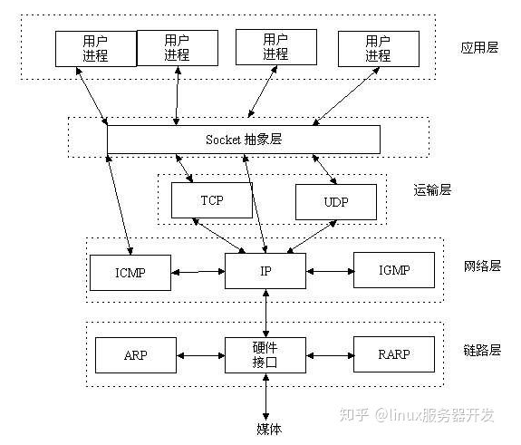
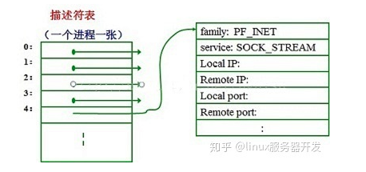
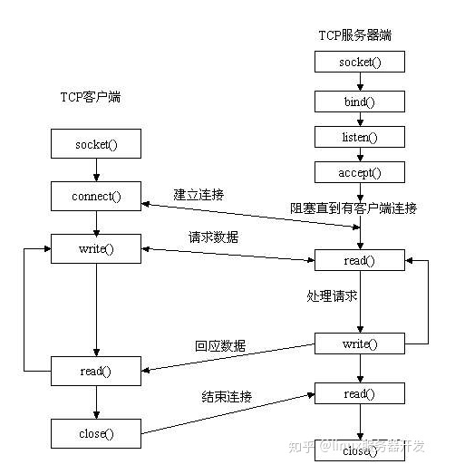
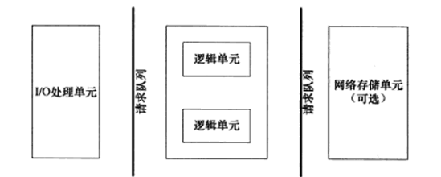

# socket

## 1. TCP/IP

TCP/IP协议族包括运输层、网络层、链路层，而socket所在位置如图，Socket是应用层与TCP/IP协议族通信的中间软件抽象层。




> 数据链路层、网络层和传输层负责处理网络通信细节，这部分必须稳定高效，因此处于**内核空间**；应用层负责处理应用程序逻辑，因此处于**用户空间**

### 1.1 数据链路层

数据链路层实现了网卡接口的网络驱动程序，以处理数据在物理媒介上的传输。对上层隐藏了不同物理网络的不同电气特性。

常用协议:

- ARP: 地址解析协议，将IP地址转化为物理地址
- RARP: 逆地址解析协议

传输基本单元:

- 帧: 帧的最大传输单元MTU，通常受到网络类型的限制。**帧是最终在物理网络上传送的字节序列**。

### 1.2 网络层

网络层实现数据包的选路和转发。对上层隐藏了网络拓扑连接的细节。

常用协议:

- IP: 因特网协议
- ICMP: 因特网控制报文协议

传输基本单元:

- 数据报

### 1.3 传输层

传输层为两台主机上的应用程序提供端到端的通信。

常用协议:

- TCP: 为应用层提供可靠的、面向连接的和基于流的服务
- UDP: 为应用层提供不可靠、无连接和基于数据报的服务
- SCTP

### 1.4 应用层

应用层负责处理应用程序的逻辑。

常用协议:

- telnet: 远程登录协议
- OSPF: 动态路由更新协议
- DNS: 域名服务


## 2. socket

在许多操作系统中，套接字描述符和其他I/O描述符是集成在一起的，所以应用程序可以对文件进行套接字I/O或I/O读/写操作。

当应用程序要创建一个套接字时，操作系统就返回一个小整数作为描述符，应用程序则使用这个描述符来引用该套接字需要I/O请求的应用程序请求操作系统打开一个文件。操作系统就创建一个文件描述符提供给应用程序访问文件。从应用程序的角度看，文件描述符是一个整数，应用程序可以用它来读写文件。下图显示，操作系统如何把文件描述符实现为一个指针数组，这些指针指向内部数据结构。

对于每个程序系统都有一张单独的表。精确地讲，系统为每个运行的进程维护一张单独的文件描述符表。当进程打开一个文件时，系统把一个指向此文件内部数据结构的指针写入文件描述符表，并把该表的索引值返回给调用者 。应用程序只需记住这个描述符，并在以后操作该文件时使用它。操作系统把该描述符作为索引访问进程描述符表，通过指针找到保存该文件所有的信息的数据结构。



### 2.1 主机字节序和网络字节序

字节序分为大端字节序和小端字节序[<sup>3</sup>](#refer-anchor-1)。

- 大端

  - 高位字节存储在内存低地址

  - 应用场景：网络传输和文件存储

- 小端

  - 高位字节存储在内存高地址

  - 应用场景：现代CPU内存存储数据

Linux 提供了如下4个函数来完成主机字节序和网络字节序之间的转换:

```c++
#include <netinet/in.h>
unsigned long int htonl(unsigned long int hostlong);  //长整型的主机字节序转化为网络字节序
unsigned short int htons(unsigned short int hostshort);
unsigned long int ntohl(unsigned long int netlong);
unsigned short int ntohs(unsigned short int netshort);
```

### 2.2 socket 地址

```c++
struct sockaddr_in {
    sa_family_t sin_family;      // 地址族： AF_INET
    u_int16_t sin_port;          // 端口号，要用网络字节序表示
    struct in_addr sin_addr;     // IPv4 地址结构体
};

struct in_addr {
  	u_int32_t s_addr;            // IPv4 地址，要用网络字节序表示  
};
struct sockaddr_in6 {
  	sa_family_t sin6_family;     // 地址族： AF_INET6
    u_int16_t sin_port;          // 端口号，要用网络字节序表示
    u_int32_t sin6_flowinfo;     // 流信息，应设置为0
    struct int6_addr sin6_addr;  // IPv6 地址结构体
    u_int32_t sin6_scope_id;     // scope ID
};
struct in6_addr {
  	unsigned char sa_addr[16];   // IPv6 地址，要用网络字节序表示  
};
```



## 3. 高性能服务器架构

### 3.1 服务器模型

- C/S架构
  - 以服务器为中心，访问量过大时，会导致客户端响应变慢
- P2P
  - 去中心化
  - 典型场景: 云计算机群

### 3.2 服务器编程框架



|     模块     |        单个服务器程序        |          服务器集群          |
| :----------: | :--------------------------: | :--------------------------: |
| I/O处理单元  | 处理客户端连接，读写网络数据 | 作为接入服务器，实现负载均衡 |
|   逻辑单元   |        业务进程或线程        |          逻辑服务器          |
| 网络存储单元 |    本地数据库、文件或缓存    |         数据库服务器         |
|   请求队列   |     各单元之间的通信方式     | 各服务器之间的永久 TCP 连接  |

### 3.3 I/O模型

- 阻塞 I/O: 程序阻塞于读写函数

- 非阻塞 I/O: 需要不断主动询问数据是否准备好

- I/O 复用: 程序阻塞于 I/O 复用系统调用，但可同时监听多个 I/O 事件，对 I/O 本身的读写操作是非阻塞的

  通过一种机制一个进程能同事等待多个文件描述符，其中任意一个进入读就绪状态，函数就可以返回

- SIGIO 信号: 信号触发读写就绪事件，用户程序执行读写操作，程序没有阻塞阶段

- 异步 I/O: 内核执行读写操作并触发读写完成事件，程序没有阻塞阶段

### 3.4 两种高效的事件处理模式

随着网络设计模式的兴起，Reactor 和 Proactor 事件处理模式应运而生。同步I/O模型通常用于实现Reactor模式，异步I/O模型则用于实现Proactor模式。

- Reactor 模式

  要求主线程(I/O处理单元)只负责监听文件描述上是否有事件发生，有的话立即通知工作线程

- Proactor 模式

  将所有 I/O 操作都交给主线程和内核来处理，工作线程仅负责业务逻辑

### 3.5 两种高效的并发模式

如果程序是计算密集型，并发编程无优势，反而由于任务的切换使效率降低。如果程序是 I/O 密集型，并发编程可显著提升 CPU 利用率。

服务器主要有两种并发编程模式：半同步/半异步模式和领导者/追随者模式。 

### 3.6 I/O 复用

- select/poll
- epoll
  - LT: 电平触发
  - ET: 边沿触发

## 3. Q&A

### 3.1 文件描述符和文件指针的区别？

**文件描述符：** 在linux系统中打开文件就会获得文件描述符，它是个很小的正整数。每个进程在PCB（Process Control Block）中保存着一份文件描述符表，文件描述符就是这个表的索引，每个表项都有一个指向已打开文件的指针。

**文件指针：** C语言中使用文件指针做为I/O的句柄。文件指针指向进程用户区中的一个被称为FILE结构的数据结构。FILE结构包括一个缓冲区和一个文件描述符。而文件描述符是文件描述符表的一个索引，因此从某种意义上说文件指针就是句柄的句柄（在Windows系统上，文件描述符被称作文件句柄）。

### 3.2 TCP 相关

#### TCP 创建连接为什么是三次握手而不是二次握手？

三次握手可以实现：

- 阻止重复的历史连接
- 同步双方出事序列号
- 避免资源浪费

#### TCP 客户端与服务端建立连接后，如果服务端一直 sleep，然后客户端一直发送数据会发生什么现象?

首先客户端发送数据会调用系统函数 send()，该函数会将客户端缓冲区的数据拷贝至内核空间套接字发送缓冲区后，即成功返回；
send()其实是一个阻塞函数，当内核缓冲区满了，就无法继续将数据从应用程序复制到发送端的套接字发送缓冲区了，从而发送端进程也进入睡眠
https://blog.csdn.net/ZHNEYU/article/details/125828679

#### TCP 客户端与服务端建立连接后，某时刻网络断连，如果确认客户端内核发送缓冲区的数据服务端是否已经收到？

#### TCP 客户端与服务端建立连接后，客户端一段时间未向服务端发送数据，如果判断连接是否还存在?

TCP keepalive机制

#### TCP 服务端挂掉，连接是否还存在？

#### TCP 未开启 keepalive，且双方没有数据交互，客户端主机崩溃，会发生什么？

服务端无感，一直处于 ESTABLISHED 状态，直至重启

#### 判断 TCP 连接的几种方式？

#### TCP 滑动窗口的必要性，解决了什么问题？

tcp 是可靠传输协议，客户端(服务端)发送完一帧数据需要等待服务端(客户端)的ACK回复，才可以继续发送下一帧数据。

TCP 协议采用滑动窗口机制来进行流量控制，允许发送端在收到接收端确认前，继续发送一定数量的数据段。避免了必须对每一段数据都进行确认的低效率。

如果不使用滑动窗口，那么工作流程将会是：

- 客户端发送一个数据段给服务端
- 客户端等待服务器确认
- 收到确认后，发送下一个数据段
- 重复步骤2和3

这种停-等工作模式会极大地降低网络的利用效率。随着网络延迟的增加,整体通信效率也会下降。而滑动窗口机制允许客户发送多个数据段,以pipeline的方式在网络中传输。这显著提高了网络利用率。发送方会维护一个发送窗口,允许发送但尚未确认的数据量。窗口大小的设置直接影响通信的性能。如果不使用滑动窗口,等同于窗口大小为1。这将严重制约TCP通信速度。所以TCP协议采用滑动窗口是非常重要的优化。它使得我们不需要对每一段小数据都进行确认,从而显著提高网络通信的性能。

### 3.3 浏览器键入网址到网页显示，期间发生了哪些事情？

(1) 浏览器引擎解析URL

URL 的组成可以分为几部分：

- 协议(protocol)：例如 http,https,ftp等
- 域名(domain name)：服务器的域名地址
- 端口(port)：默认是80
- 路径(path)：服务器上的资源路径，例如 page.html
- 查询参数(query string)：可选，以 key=value 形式指定查询参数
- 片段标识符(fragment identifier)：锚点在页面中的位置，例如 #top

完整示例:

```
https://www.example.com:8080/path/page.html?key=value#top
```

(2) 生成 http 请求及通过 DNS 查询服务器域名所对应的 IP

(3) TCP -> IP -> 网卡驱动 -> 网卡

### 3.4 多路复用

1. 为什么epoll比select更快？
2. epoll

## 4. 参考链接

<div id="refer-anchor-1"></div>

- [1] [Linux SOCKET编程](https://zhuanlan.zhihu.com/p/180556309)

<div id="refer-anchor-2"></div>

- [2] [socket 编程](http://c.biancheng.net/view/2123.html)

<div id="refer-anchor-3"></div>

- [3] [字节序](https://www.51cto.com/article/694603.html)

