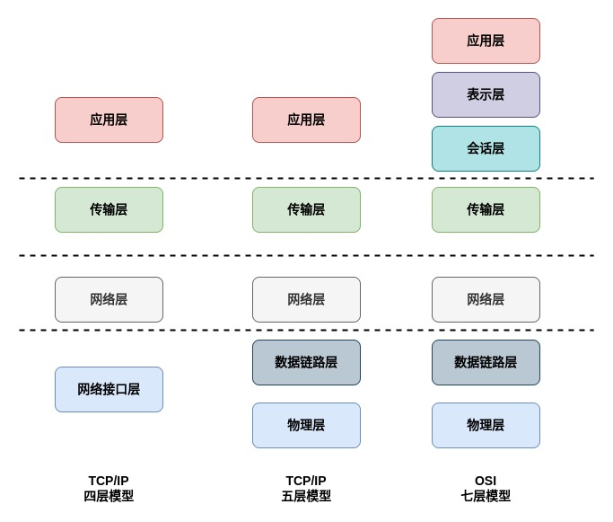
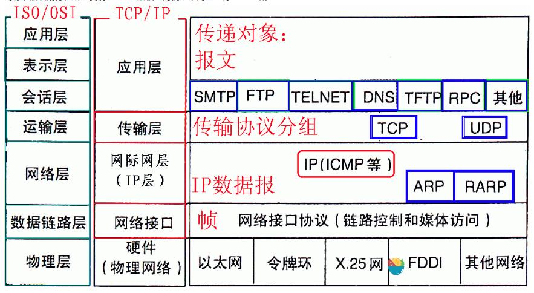
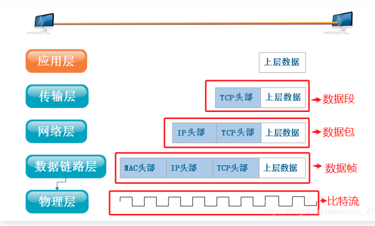

# 计算机网络模型

## 1. 网络层次划分

- OSI 七层模型
- TCP/IP 五层模型
- TCP/IP 四层模型

## 2. OSI 七层网络模型

> 网络标准网络层次划分

### 2.1 物理层(Physical Layer)

该层为上层协议提供了一个传输数据的可靠的物理媒体。简单的说，物理层确保原始的数据可在各种物理媒体上传输。物理层记住两个重要的设备名称，中继器（Repeater，也叫放大器）和集线器(HUB)。

**作用：**

- 建立、维护，断开物理连接

**重要知识点：**

- 以二进制形式在物理介质传输数据
- 主要的协议：ISO2110，IEEE802，IEEE802.2

### 2.2 数据链路层(Data Link Layer)

数据链路层在物理层提供的服务的基础上向网络层提供服务，其最基本的服务是将源自网络层来的数据可靠地传输到相邻节点的目标机网络层。

**作用:**

- 建立逻辑连接
- 物理地址寻址
- 数据的成帧
- 流量控制
- 数据的检错、重发

**重要知识点:**

- 数据链路层屏蔽传输介质的物理特性，使数据可靠传输
- 基本数据单位为**帧**
- 主要的协议：SLIP，CSLIP，PPP，ARP，RARP，MTU
- 两个重要设备：网桥和交换机

### 2.3 网络层(Network Layer)

网络层的目的是实现两个端系统之间的数据透明传送，具体功能包括寻址和路由选择、连接的建立、保持和终止等。它提供的服务使传输层不需要了解网络中的数据传输和交换技术。

**重要知识点：**

- 网络层负责对子网间的**数据包**进行路由选择。可以实现拥塞控制、网际互联等功能
- 基本数据单位为 IP 数据报
- 包含的主要协议：
  - IP 协议(Internet Protocol，因特网互联协议)
  - ICMP 协议(Internet Control Message Protocol，因特网控制报文协议)
  - ARP(Address Resolution Protocol，地址解析协议)
  - RARP(Reverse Address Resolution Protocol，逆地址解析协议)
- 重要设备：路由器

### 2.4 传输层(Transport Layer)

传输层负责将上层数据分段并提供端到端的、可靠的或不可靠的传输。此外，传输层还要处理端到端的差错控制和流量控制问题。

**重要知识点：**

- 传输层负责将上层数据分段并提供端到端的、可靠的或不可靠的传输以及端到端的差错控制和流量控制问题
- 包含的主要协议：
  - TCP 协议(Tranmission Control Protocol，传输控制协议)
  - UDP 协议(User Datagram Protocol，用户数据报协议)
- 重要设备：网关

### 2.5 会话层(Session Layer)

会话层管理主机之间的会话进程，即**负责建立、管理、终止进程之间的会话**。会话层还利用在数据中插入校验点来实现数据的同步。

### 2.6 表示层(Presentation Layer)

表示层对上层数据或信息进行变换以保证一个主机应用层信息可以被另一个主机的应用程序理解。表示层的数据转换包括数据的加密、压缩、格式转换等。

### 2.7 应用层(Application Layer)

为操作系统或网络应用程序提供访问网络服务的接口。

**会话层、表示层和应用层重点：**

- 数据传输基本单位为报文
- 包含的主要协议：
  - FTP(文件传送协议)
  - Telnet(远程登录协议)
  - DNS(域名解析协议)
  - SMTP(邮件传送协议)
  - POP3(邮局协议)
  - HTTP(超文本传输协议)

## 3. 数据传输过程

**术语：**

- **包**可以说是全能型术语
- **帧**用于表示数据链路层中包的单位
- **数据包**是 IP 和 UDP 等网络层以上的分层中包的单位
- **段**则表示 TCP 数据流中的信息
- **消息**是指应用协议中数据的单位

## 4. Q&A

1. 两个硬件之间如何通信？

   物理层

2. 如何选择通过不同介质传输数据？

   数据链路层

3. 传输大量数据时，如何保证稳定、准确传输？

   传输层（数据封装）

4. 如何准确将数据传输到指定机器？

   网络层

5. 能否避免每次手动调用 TCP 去打包，然后调用 IP 协议去找路由？

   会话层

6. 如何在不同系统间传输数据？

   表示层

7. 为什么 TCP/IP 几乎取代了 OSI？

- OSI 的专家缺乏实际经验，他们在完成 OSI 标准时缺乏商业驱动力
- OSI 的协议实现起来过分复杂，而且运行效率很低
- OSI 制定标准的周期太长，因而使得按 OSI 标准生产的设备无法及时进入市场（20 世纪 90 年代初期，虽然整套的 OSI 国际标准都已经制定出来，但基于 TCP/IP 的互联网已经抢先在全球相当大的范围成功运行了）
- OSI 的层次划分不太合理，有些功能在多个层次中重复出现。

## 5. 参考链接

[1] [计算机网络基础知识总结](https://www.runoob.com/w3cnote/summary-of-network.html)

[2] [TCP/IP 与 OSI：两种模型之间的区别是什么？](https://zhuanlan.zhihu.com/p/441680495)