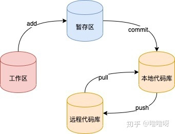

# git



## 1. 常用命令

### 1.1 分区转换指令

**git add**

- 撤销

```shell
# 撤销上次所有 add
git reset HEAD
# 撤销单个文件 add
git reset HEAD <file>
```

**git commit**

- 覆盖 commit

```shell
# 使用上一次 git commit log，push 时需加 -f
git commit --ament
```

- 撤销

```shell
# 撤销 commit，删除未提交代码
git reset --hard HEAD^
# 撤销 commit，保留未提交代码
git reset --soft HEAD^
```

**git push**

```shell
# push 到对应分支并覆盖 
git push origin <branch> -f
```

### 1.2 分区对比指令

**git diff**

### 1.3 版本 tag

- tag 拉取及查看

```shell
git fetch --tags
git tag --list
git show <tag name>
```

- tag 及推送

```shell
# 为 HEAD 打 tag
git tag <tag name> -m "information"
# 为指定 commit 打 tag
git tag <tag name> <commit id> -m "information"
# 推送单个 tag
git push origin <tag name>
# 推送所有 tag
git push origin --tags
```
