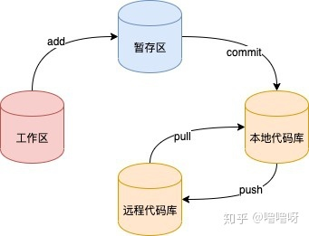

# git 教程



## 1. 常用命令

### 1.1 git add

```shell
# 将文件添加到暂存区
git add <file>
# 撤销上次所有 add
git reset HEAD
# 撤销单个文件 add
git reset HEAD <file>
```

**git push**

```shell
# push 到对应分支并覆盖 
git push origin <branch> -f
```

### 1.2 git commit

- 覆盖 commit

```shell
# 使用上一次 git commit log，push 时需加 -f
git commit --ament
```

- 撤销

```shell
# 撤销 commit，删除未提交代码
git reset --hard HEAD^
# 撤销 commit，保留未提交代码
git reset --soft HEAD^
```

### 1.3 git rebase

```shell
git rebase <branch> # rebase 到指定分支
```

### 1.4 git tag

- tag 拉取及查看

```shell
git fetch --tags
git tag --list
git show <tag name>
# 查看所有tag及打tag的日期
git log --tags --simplify-by-decoration --pretty="format:%ci %d"
```

- tag 推送及删除

```shell
# 为 HEAD 打 tag
git tag <tag name> -m "information"
# 为指定 commit 打 tag
git tag <tag name> <commit id> -m "information"
# 推送单个 tag
git push origin <tag name>
# 推送所有 tag
git push origin --tags
# 删除本地 tag
git tag -d <tag name>
# 删除远程 tag
git push origin :refs/tags/tag_name
```

### 1.5 git branch

```shell
#  删除一条分支
git branch -D <branch name>
# 删除当前分支外的所有分支
git branch | xargs git branch -d
# 删除远程分支
git push origin :branch_name
```

### 1.6 git stash

```shell
# 将工作区和暂存区的内容保存至堆栈
git stash
# 显示保存进度列表
git stash list
# 恢复最新进度至工作区
git stash pop
# 恢复指定进度到工作区
git stash pop <stash_id>
# 删除所有存储进度
git stash clear
# 展示存储进度的详细信息
git stash show -p <stash_id>
```

## 2. git subtree

> 使用场景:
>
> 将项目 A 不丢失提交记录的情况下，合并到项目 B

```shell
git subtree add --prefix=rails git://github.com/rails/rails.git master
```

参考链接:[如何合并两个Git库](https://stackoverflow.com/questions/1425892/how-do-you-merge-two-git-repositories)

## 3. git cherry-pick

> 使用场景:
>
> 将指定的 commit 应用与其他分支

参考链接:[git cherry-pick 教程](https://www.ruanyifeng.com/blog/2020/04/git-cherry-pick.html)

## 4. 修改远程仓库的commit

### 4.1 修改最新次提交的commit

```shell
git commit --amend
```

通过 vim 修改 commit message 后需要强推至远程仓库。

### 4.2 修改指定提交的commit

(1) 获取指定 commit，通过打补丁方式将该 commit 之后的提交逐个暂存

```shell
git format-patch <commit id>  # 按照commit的提交顺序依次打patch
# 0001-feat-a.patch
# 0002-feat-b.patch
```

(2) HEAD 指针移至指定 commit

```shell
git reset --hard <commit id>
```

(3) 修改当前commit message

```shell
git commit --amend
```

(4) 恢复 patch

```shell
git am 0001-feat-a.patch
git am 0002-feat-b.patch
```

(5) 强推至远程仓库

```shell
git push orign <branch> -f
```


