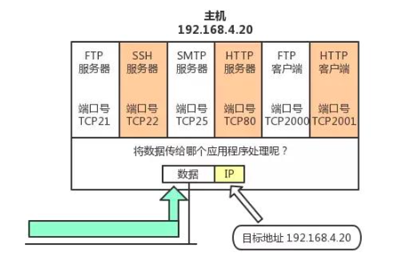
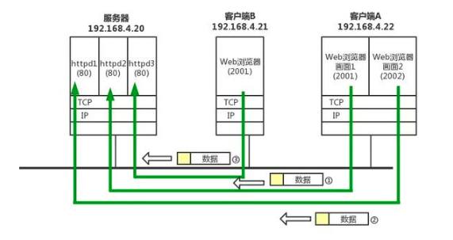
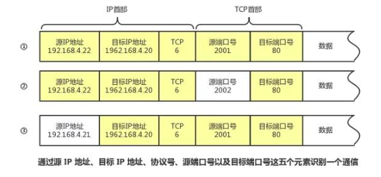

# 传输层之 TCP 和 UDP

## 1. 端口号

数据链路和 IP 中的地址，分别指的是 MAC 地址和 IP 地址。

- MAC 地址：识别同一链路中不同的计算机
- IP 地址：识别 TCP/IP 网络中互联的主机和路由器

在传输层也有这种类似于地址的概念，那就是端口号。端口号用来识别同一台计算机中进行通信的不同应用程序。因此，它也被称为程序地址。

利用三元组（ip地址，协议，端口）就可以标识网络的进程了，网络中的进程通信就可以利用这个标志与其它进程进行交互。

### 1.1 根据端口号识别应用

一台计算机上同时可以运行多个程序。传输层协议正是利用这些端口号识别本机中正在进行通信的应用程序，并准确地将数据传输。

### 1.2 通过 IP 地址、端口号、协议号进行通信识别

① 和② 的通信是在两台计算机上进行的。它们的目标端口号相同，都是80。这里可以根据源端口号加以区分。

③ 和 ① 的目标端口号和源端口号完全相同，但它们各自的源 IP 地址不同。

此外，当 IP 地址和端口号全都一样时，我们还可以通过协议号来区分（TCP 和 UDP）。

## 2. TCP

- 面向连接的、可靠的流协议
- 实现了数据传输时各种控制功能

## 3. UDP

- 不具有可靠性的数据报协议
- 面向无连接的通信服务
- 应用场景：
  - 包总量较少的通信
  - 视频、音频等多媒体通信
  - 限定于 LAN 等特定网络中的应用通信
  - 广播通信

## 4. 参考链接

[1] [TCP/IP协议](https://www.51cto.com/article/597961.html)
