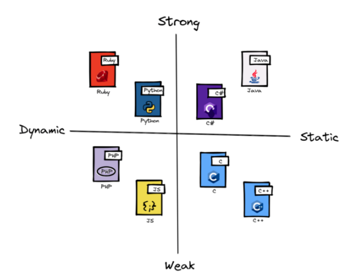
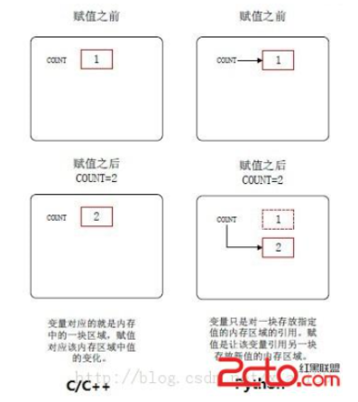

# 类型系统

## 基本概念

### 类型

类型是对数据做的一种分类，定义了能够**对数据执行的操作**、**数据的意义**以及**允许数据接受的值的集合**。编译器和运行时会检查类型，以确保数据的完整性，实施访问限制，以及按照开发人员的意图来解释数据。

### 类型系统

类型系统是一组规则，为编程语言的元素**分配和实施类型**。这些元素可以是变量、函数和其他高级结构。类型系统通过两种方式分配类型：程序员在代码中指定类型，或者类型系统根据上下文，隐式推断出某个元素的类型。类型系统允许在类型之间进行某些转换，而阻止其他类型的转换。

类型系统，就是复杂软件系统的"负反馈调节器"。通过一套类型规范，加上编译监控和测试机制，来实现软件系统的数据抽象和运行时数据处理的安全。

### 类型强度

强类型和弱类型的区别没有权威的定义。大多数早期关于强类型和弱类型的讨论可以概括为静态类型和动态类型之间的区别。

但流行的说法是强类型倾向于不容忍隐式类型转换，而弱类型倾向于容忍隐式类型转换。这样，强类型语言通常是类型安全的，也就是说，它只能以允许的方式访问它被授权访问的内存。

### 静态类型与动态类型

二者区别在于**类型检查发生的时间**。

1. 静态类型系统在编译时确定所有变量的类型，并在使用不正确的情况下抛出异常。静态类型系统，将运行时错误转换成编译时错误，能够使代码更容易维护、适应性更强，对于大型应用程序，尤其如此。
2. 动态类型系统在运行时确定变量类型，检查是在运行时进行的。如果有错误则抛出异常，如果没有适当的处理，可能会导致程序崩溃。

## 编程语言中的数据类型

一般来说，编程语言者会有两种类型，一种是**内建类型**，如 int、float 和 char 等，一种是**抽象类型**，如 struct、class 和 function 等。抽象类型在程序运行中，可能不表示为值。类型系统在各种语言之间有非常大的不同，也许，最主要的差异存在于编译时期的语法，以及运行时期的操作实现方式。

类型的约束程度以及评估方法，影响了语言的类型。更进一步，编程语言可能就类型多态性部分，对每一个类型都对应了一个针对于这个类型的算法运算。类型理论研究类型系统，尽管实际的编程语言类型系统，起源于计算机架构的实际问题、编译器实现，以及语言设计。

程序语言的类型系统主要提供如下的功能。

- **程序语言的安全性**。使用类型可以让编译器侦测一些代码的错误。例如：可以识别出一个错误无效的表达式。如：`“Hello, World” + 3`这样的不同数据类型间操作的问题。强类型语言提供更多的安全性，但是并不能保证绝对的安全。
- **利于编译器的优化**。静态类型语言的类型声明，可以让编译器明确地知道程序员的意图。因些，编译器就可以利用这一信息做很多代码优化工作。例如：如果我们指定一个类型是`int`，那么编译就知道，这个类型会以 4 个字节的倍数进行对齐，编译器就可以非常有效地利用更有效率的机器指令。
- **代码的可读性**。有类型的编程语言，可以让代码更易读和更易维护。代码的语义也更清楚，代码模块的接口（如函数）也更丰富和更清楚。
- **抽象化**。类型允许程序设计者对程序以较高层次的方式思考，而不是烦人的低层次实现。例如，我们使用整型或是浮点型来取代底层的字节实现，我们可以将字符串设计成一个值，而不是底层的字节的数组。从高层上来说，类型可以用来定义不同模块间的交互协议，比如函数的入参类型和返回类型，从而可以让接口更有语义，而且不同的模块数据交换更为直观和易懂。

但是，正如前面说的，**类型带来的问题就是我们作用于不同类型的代码，虽然长得非常相似，但是由于类型的问题需要根据不同版本写出不同的算法，如果要做到泛型，就需要涉及比较底层的玩法**。

对此，这个世界出现了两类语言，一类是静态类型语言，如 C、C++、Java，一种是动态类型语言，如 Python、PHP、JavaScript 等。

**我们需要清楚地知道，无论哪种程序语言，都逃避免不了一个特定的类型系统**。哪怕是可随意改变变量类型的动态类型的语言，我们在读代码的过程中也需要脑补某个变量在运行时的类型。

所以，每个语言都需要一个类型检查系统。

> 类型检查：类型检查确保程序遵守类型系统的规则。编译器在转换代码时进行类型检查，而运行时在执行代码时进行类型检查。编译器中负责实施类型规则的组件叫作类型检查器。如果类型检查失败，则意味着程序没有遵守类型系统的规则，此时程序将会编译失败，或者发生运行时错误。“遵守类型系统规则的程序相当于一个逻辑证明。”

- 静态类型检查是在编译期进行语法分析时进行的。如果一个语言强制实行类型规则（即通常只允许以不丢失信息为前提的自动类型转换），那么称此处理为强类型，反之称为弱类型。
- 动态类型检查系统更多的是在运行时期做动态类型标记和相关检查。所以，动态类型的语言必然要给出一堆诸如：`is_array()`,`is_int()`,`is_string()`或是`typeof()`这样的运行时类型检查函数。

## 变量的本质

变量来源与数学，是计算机语言中能够存储计算结果或能表示值抽象概念，变量可以通过变量名访问。

### 静态语言变量（以C++为例）

**变量本质**：一段连续内存空间的别名。

变量对应[内存](https://so.csdn.net/so/search?q=内存&spm=1001.2101.3001.7020)中的一块区域，当修改这个值时，直接修改内存区域中的值。C++ 中每个变量都有指定的类型，类型决定了变量存储的大小和布局，该范围内的值都可以存储在内存中，运算符可应用于变量上。

变量的关键要素为：

- 变量名
- 数据类型
- 值
- 值域
- 生命周期

### 动态语言变量（以python为例）

变量只是对一块存放指定值的内存区域的引用，赋值时是让该变量引用另一块存放新值的内存区域。因此在赋值时等号左边的变量类似于标签，等号右边的是值对应的地址。

## 参考链接

[1] [类型系统的泛型的本质](https://mendylee.gitbooks.io/geeker-study-courses/content/bian-cheng-fan-shi-pian/lei-xing-xi-tong-he-fan-xing-de-ben-zhi.html)

[2] [编程语言:类型系统的本质](https://segmentfault.com/a/1190000042060686)

[3] [编程语言的本质](https://segmentfault.com/a/1190000021361639?utm_source=sf-similar-article)

